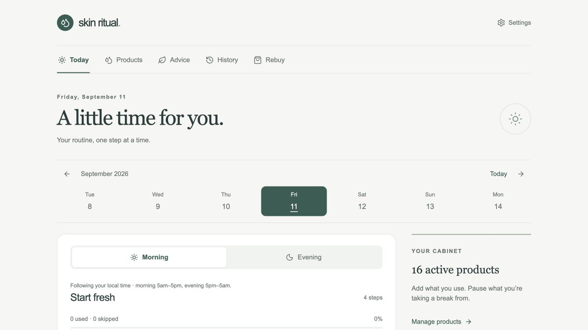
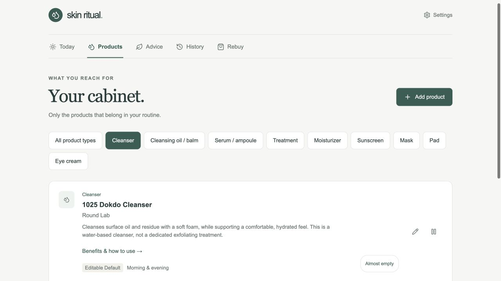
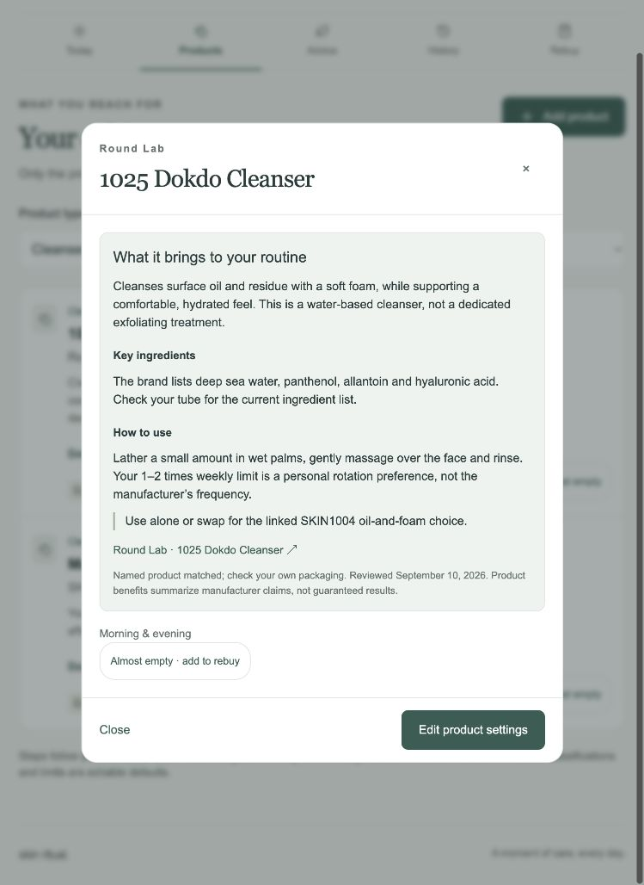
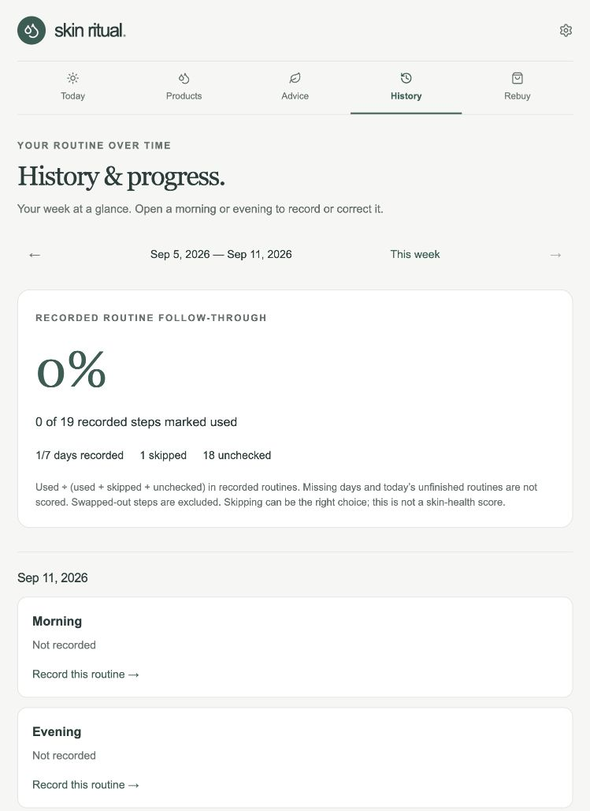
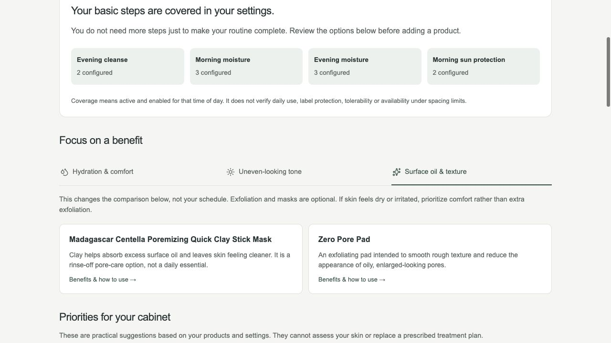
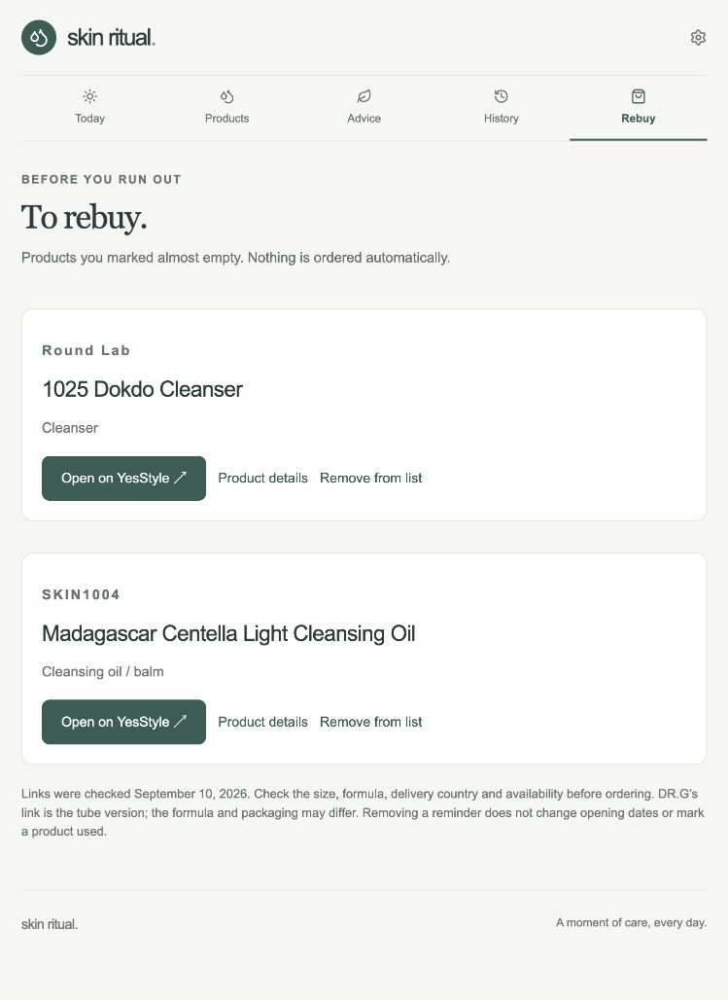
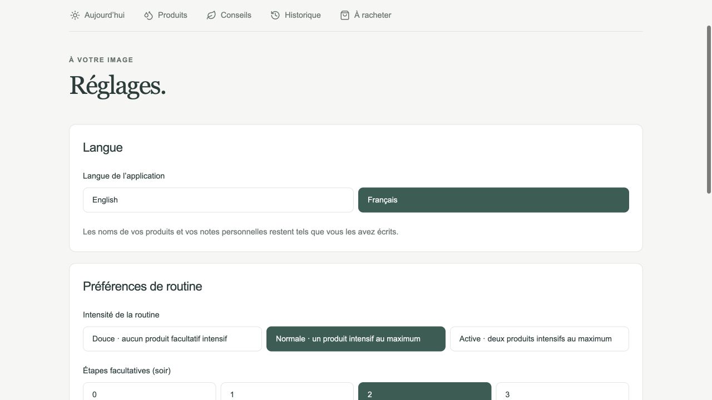

# Skin Ritual

**What should I use on my skin right now?**

A calm, personal home for your skincare products. See what fits your morning or evening, check off what you use, and let your recent history guide the next routine.

**[Open Skin Ritual →](https://emmavellard.github.io/SkinRitual/)**

No account, ads, or subscription. Your personal records stay on your device.

## A few seconds, morning and evening

Open **Today** to see your routine. Morning is selected from 5am to 5pm; evening from 5pm to 5am, using your local time. You can switch manually or return to **Use current time**.

- Tap the circle beside a product when you use it. Tap again to undo the checkmark.
- **Skip** leaves a step out without counting it as used.
- **Swap** offers alternatives that fit your routine. Round Lab and the SKIN1004 oil-and-foam pair can replace each other, including as an explicit morning choice, and your moisturizers can replace one another.
- **Undo skip**, under the skipped product, or **Undo swap** restores the earlier choice. Undo is available while the affected steps are unchanged; it preserves other products you have already checked off.

Everything saves automatically. A started routine keeps its steps, so editing your cabinet will not rearrange your checklist halfway through.

## Your products are already here

A fresh cabinet contains **17 products**, with consistent names and editable defaults:

| Brand | Products |
| --- | --- |
| SKIN1004 | Madagascar Centella Ampoule; Hyalu-Cica Water-Fit Sun Serum; Probio-Cica Bakuchiol Eye Cream; Niacinamide 10 Boosting Shot Ampoule; Poremizing Quick Clay Stick Mask; Tone Brightening Dark Spot Ampoule Pad; Light Cleansing Oil; Ampoule Foam; Hyalu-Cica Cloudy Mist |
| Medicube | Zero Pore Pad; Deep Vita C Capsule Cream |
| Beauty of Joseon | Relief Sun: Rice + Probiotics |
| Round Lab | 1025 Dokdo Cleanser |
| Dr.G | R.E.D Blemish Clear Soothing Cream |
| Avène | Hydrance Light Hydrating Emulsion |
| Treatments | Differin; Cutacnyl |

The cabinet update corrects the old COSRX name to **Round Lab 1025 Dokdo Cleanser**, removes the unowned Air-Fit sunscreen, and adds DR.G and Avène once. Existing notes, opening dates, treatment preferences and usage records are kept. Later edits and deletions remain yours.

Choose a product type from the side-by-side buttons—cleanser, moisturizer, sunscreen, pads and more. Open **Benefits & how to use** for the product’s explanation without opening its settings. The pencil button opens editing separately.

You can add, edit, pause, finish or delete products. Routine order follows their role automatically; custom ordering is available under advanced settings. Opening dates, PAO and printed expiration dates are optional and are never guessed.

## Variety without a rigid schedule

The app chooses a small routine from your available products, using your actual recorded use, spacing and frequency preferences.

It chooses one sunscreen and one moisturizer, keeps the evening oil-and-foam pair together, and avoids stacking multiple pads. Less recently used optional products rotate. Eligible evening pads receive priority, while masks and the niacinamide ampoule still get space across the week.

The starting limit is **one optional step in the morning and two in the evening**. Normal intensity allows at most one intensive product; gentle mode excludes intensive optional products. Pads and clay masks use separate days by default. You can change these preferences in **Settings**.

Niacinamide starts in the evening, up to twice in seven days with two days between uses. The brightening pad starts with a three-use limit and a day between uses. These are editable app scheduling defaults, not treatment instructions or a guarantee of skin tolerance.

**Differin and Cutacnyl remain outside automatic suggestions until you configure them**, following your own treatment instructions.

Open **Why these products?** to see what each included product brings—hydration, soothing care, brighter-looking tone or UV protection. Skipped and replaced products are left out of this explanation.

## Browse days and keep an honest history

Use the compact seven-day strip and week arrows on Today. There is no calendar popup. Tap **Today** to return.

Future routines are previews, not records. For the next 31 days, previews assume you follow the intervening suggestions, allowing you to see possible rotation. Your actual checkmarks can change the plan; nothing is automatically recorded.

**History** brings your records and progress together. Move between weeks, then open a morning or evening to add a missed routine or correct one. Set each product to Used, Skipped or Not recorded, add or remove products, and adjust the usage time. Past records initially use 08:00 or 20:00 local time; correct these if needed.

The weekly score is **Used ÷ (Used + Skipped + Unchecked)** in recorded routines. It excludes swapped-out steps and today’s unfinished routines. Missing days are unknown, not failures. The score measures your own record keeping and follow-through—not skin health or treatment effectiveness. Skipping can be the right choice.

## Advice based on what you own

**Advice** reviews your cleansing, moisturizing and sunscreen coverage, compares overlapping benefits, and highlights useful changes. Choose hydration, uneven-looking tone, or surface oil and texture from the navigation-style benefit menu.

DR.G and Avène are recognized as moisturizer alternatives, so the app no longer assumes you only have the Medicube vitamin C cream. Optional alternatives include a hydrating pad and a gel-cream; there is no suggestion that you need to buy more products just to complete a routine.

Product benefits and usage descriptions come with source links. Information was reviewed on **September 10, 2026**. Exact treatment strengths, the Zero Pore Pad variant and the Avène market formula still need checking against your packaging. Manufacturer claims are not guaranteed results.

Advice works locally using the bundled information. External sources need an internet connection. There is no live trend feed, skin diagnosis, or upload of your cabinet.

## Remember what to rebuy

Mark a product **Almost empty** directly on Today, in Products or its details page. It appears in **Rebuy**, with a direct YesStyle link where a listing was verified. Remove the reminder when you no longer need it.

Check the size, version, country of delivery and availability before ordering. The DR.G link is for a tube version. Medicines without a verified YesStyle listing point you back to your usual pharmacy. Nothing is ordered automatically, and clearing a reminder does not change opening dates.

## English or French

Settings are stacked vertically with every option visible—no dropdowns or collapsed preference lists. Open **Settings → App language** and choose **Français** or **English**. The interface, product explanations and advice change language; your product names and personal notes stay as written. Your choice is saved on this device.

## Dates and backups

Record the date opened and the PAO printed on your packaging. The app calculates opening date + PAO and compares it with any printed expiration date, showing the earlier one. Reminders begin 30 days before that date. They reflect your records, not an assessment of the product’s condition.

In **Settings**, choose **Download backup** and keep the file privately. It includes products, language and routine preferences, almost-empty reminders and history.

To restore, choose a backup and review it before replacing your current data. Restore replaces rather than merges. **Undo last restore** returns to the data from just before that restore, replacing any later changes. Keep a downloaded copy if you want a permanent backup.

## Keep it on your iPhone

Open [Skin Ritual](https://emmavellard.github.io/SkinRitual/) in Safari, then choose **Share → Add to Home Screen**. After the app has loaded online and saved its offline files, it can reopen without a connection.

Use the same browser or Home Screen app consistently. Personal data is not uploaded to GitHub or synchronized between devices. Another browser, device, address or Home Screen installation may have separate storage. Use backups to move your data.

Clearing website data can erase your records. If an update does not appear, reload—do not clear your data just to get the new version.

## Your morning start

In Settings, choose **Cleanser when eligible** or **Mist first · no cleanser suggested**. The second option starts unstarted morning routines with your eligible Hyalu-Cica Cloudy Mist, within the optional-step limit, and leaves out cleansers. A mist hydrates; it does not wash away residue. Water-only morning washing can suit dry or sensitive skin. Your existing morning preference stays unchanged until you choose this option.

Medicube specifies Deep Vita C Capsule Cream for morning and evening. There is no manufacturer recommendation to reserve it for nighttime. Its time assignment stays editable.
